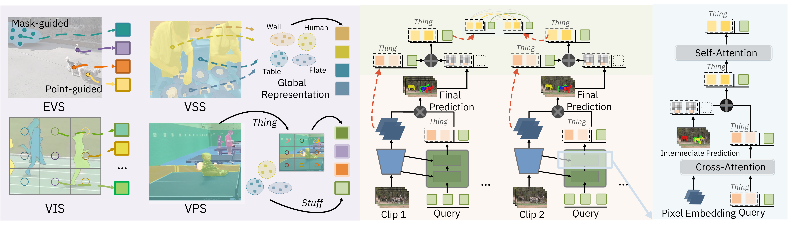

# GvSeg: General and Task-Oriented Video Segmentation



>[GvSeg: General and Task-Oriented Video Segmentation]() <br>
>[Mu Chen](https://scholar.google.com/citations?user=eyBlZUUAAAAJ&hl=zh-CN), [Liulei Li](https://scholar.google.com/citations?user=eCrBWngAAAAJ&hl=en), [Wenguan Wang](https://sites.google.com/view/wenguanwang), [Ruijie Quan](https://scholar.google.com/citations?user=WKLRPsAAAAAJ&hl=en) [Yi Yang](https://scholar.google.com/citations?hl=zh-CN&user=RMSuNFwAAAAJ&view_op=list_works)
>

This is the official implementation of "GvSeg: General and Task-Oriented Video Segmentation" (Accepted at ECCV 2024).

## Abstract
We present GvSeg, a general and task-oriented video segmentation framework for addressing four different video segmentation tasks (i.e., instance, semantic, panoptic, and exemplar-guided) while maintain- ing an identical architectural design. Currently, there is a trend towards developing general video segmentation solutions that can be applied across multiple tasks. This streamlines research endeavors and simplifies deploy- ment. However, such a highly homogenized framework in current design, where each element maintains uniformity, could overlook the inherent diversity among different tasks and lead to suboptimal performance. To tackle this, GvSeg: i) provides a holistic disentanglement and modeling for segment targets, thoroughly examining them from the perspective of appearance, position, and shape, and on this basis, ii) reformulates the query initialization, matching and sampling strategies in alignment with the task-specific requirement. These architecture-agnostic innovations empower GvSeg to effectively address each unique task by accommodat- ing the specific properties that characterize them. Extensive experiments on seven gold-standard benchmark datasets demonstrate that GvSeg surpasses all existing specialized/general solutions by a significant margin on four different video segmentation tasks. 

## Code

Coming soon...

## Citation

If you find this work useful in your research, please star our repository and consider citing:

```

```

## Contact

Any comments, please email: mu.chen@student.uts.edu.au.
